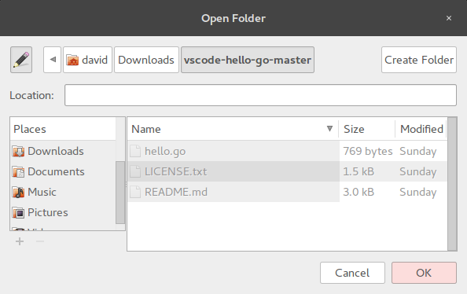
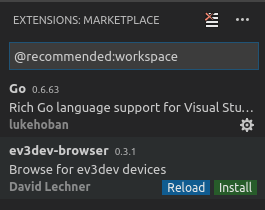
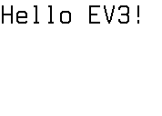

# vscode-hello-go
Hello World for [ev3dev] + [Visual Studio Code][code] + [Go]

## Overview
This is a git repository to help you get started programming a robot using
ev3dev in Visual Studio Code using the Go programming language.

## Prerequisites
* LEGO MINDSTORMS EV3, Dexter Industries Brick Pi, Mindsensors PiStorms, or
  FatcatLab EVB with [ev3dev] installed. **Does not work with ev3dev-jessie!
  Be sure to grab a snapshot image of ev3dev-stretch.**
* A computer (Windows, macOS, or Linux) with [Go], [Visual Studio Code][code] and
  [git] (or [GitHub Desktop][github]) installed.

## Step-by-Step
1.  Download the [vscode-hello-go][zip] project from GitHub and unzip it.

    [zip]: https://github.com/ev3dev/vscode-hello-go/archive/master.zip

2.  Open the `vscode-hello-go-master` folder in Visual Studio Code.

    

    

6.  Click *Show Recommendations* when asked.

    

7.  Install the `ev3dev-browser` extension. The Go extension is optional, but it
    is nice to have too.

    

8.  After installation completes, click *Reload* and *Reload Window*.

    

    

9. Open the *Explorer* activity pane.

    

10. Click the arrow next to *EV3DEV DEVICE BROWSER* to open it.

    

    

11. Ensure that your ev3dev device is turned on and has a network connection to
    the host computer. USB, Bluetooth, Wi-Fi or wired will work.

12. Click the text where it says "Click here to connect to a device".
    A box will pop up that lists discovered devices. Select one.

    

13. Once the device has connected, you will see a green dot and the
    `/home/robot` folder.

    

14. Press <kbd>F5</kbd> to download the program and run it.

15. The *Output* pane will automatically open and show the status of the
    program and any error/debug messages.

    

    

18. Open the source code file, [hello.go](./hello.go), to learn more.

[ev3dev]: http://www.ev3dev.org
[code]: https://code.visualstudio.com/
[go]: https://golang.org/
[git]: https://git-scm.com/
[github]: https://desktop.github.com/
